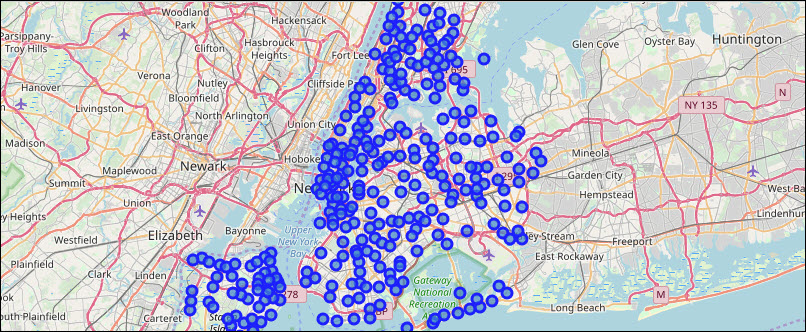
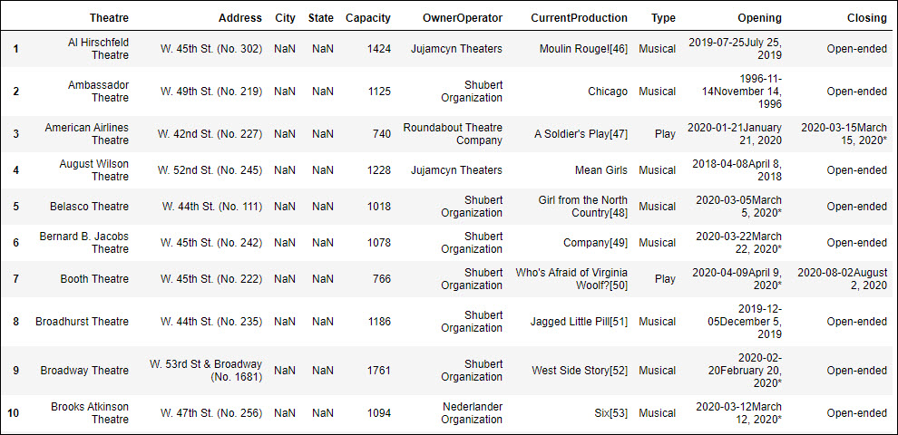

#  IBM Data Science Capstone Project 
## Planning Travel and Tours in New York City's Broadway Theatre District
### Comparison of Hotels, Restaurants, and Theaters in Manhattan, NY for a Broadway Theater Trip
### Brian Vineyard 

## INTRODUCTION

This is my final Capstone Project for the IBM Data Science Professional Certification through Coursera.

Students were tasked with using data science tools and methods to do a detailed study of a city using the Foursquare API.

This project involved the use of Python 3 and Jupyter Notebooks. Tools used include pandas, numpy, JSON, pickle, GeoPy, BeautifulSoup, matplotlib, and sklearn.

### Business Problem


**Business Problem**: A travel service is planning to offer Broadway trips with the best options in New York City, NY to include on their package. They want to build a package with a list of Broadway shows, a recommended hotel, and a list of nearby restaurants. 

Their clients are mostly interested in Broadway musicals and plays, so this project will focus on finding the best hotel and restaurants near the Broadway theater district.


**Key Questions to Answer**

- What are the best theaters to catch the top Broadway shows?
- What hotels close to the Theater District have the best ratings and room rates?
- What are the best nearby restaurants?


**Foursquare API study of following city**:

- Broadway Theatre District, New York City, NY

Example search criteria: Hotels, Restaurants, Museums, Live Shows

**Project Details**: 

This project uses the following tools and technology:

- [Foursquare Places API](https://https://enterprise.foursquare.com/products/places)
- [2014 New York City Neighborhood Names](https://geo.nyu.edu/catalog/nyu_2451_34572)
- [BeautifulSoup](https://beautiful-soup-4.readthedocs.io/en/latest/)


The goal is to find the best area of the city to hold tours, based on our findings.

## DATA SOURCES

This project will use the following data:

- **Latitude and longitude of neighborhoods from the five boroughs of New York, NY**
  Source: 2014 New York City Neighborhood Names: https://geo.nyu.edu/catalog/nyu-2451-34572
- **Broadway Theatre Wiki with Current Shows in Production**
  Source: https://en.wikipedia.org/wiki/Broadway_theatre
- **Hotels and Restaurants near the Richard Rodgers Theatre - (where *Hamilton* is playing)
  Source: API Queries of Foursquare 
 - **Reviews of Hotels and Restaurants in the Foursquare Dataset
  Source: Google Reviews, Hotels.com data

## METHODOLOGY

The coordinates will be passed to the Foursquare Places API, for querying New York City neighborhoods for venues such as:

- **Restaurants**
    - Liebman's Deli, La Morada, Royal 35 Steakhouse, Le Benardin
- **Hotels**
    - Gramercy Park, Life Hotel Nomad, Mansfield Hotel
- **Fun**
    - Museums: Metropoliton Museum of Art, 9/11 Memorial, American Museum of Natural History
    - Top Tourist Destinations: Empire State Building, Madison Square Garden, Statue of Liberty, Times Square
    - Broadway Productions: Hamilton, The Lion King, Wicked, Moulin Rouge, Phantom of the Opera
    - Sightseeing Cruises: Circle Line Full Island, Classic Harbor Lines, Zephyr Yacht, Liberty Cruises
    - Parks: Central Park, Washington Square Park, Fort Tryon Park, Bronx Zoo, 
    
 ### Table of Contents
 1. [Import Libraries, Foursquare Credentials](#import-1)
 2. [New York's Manhattan Borough Neighborhood Data](#borough-2)
   - [Map of Neighborhoods in New York City's Five Boroughs](#borough-map)
   - [Map of Neighborhoods in NYC's Manhattan Borough](#neighor-map)
 3. [Broadway Theatres and Current Productions](#broadway-3)
   - [Map of Broadway Theatre Locations](#broadway-map)
 4. [Hotels Near the Broadway Theatre District](#hotels-4)
   - [Map of Hotels Near Broadway Theatres](#hotels-map)
 5. [Restaurants Near the Broadway Theatre District](#restaurants-5)
   - [Map of Restaurants Near Broadway Theatres](#rest_map)
 6. [Conclusions and Findings](#conclusions)
 
## 1. Import Libraries, Foursquare Credentials, and Neighborhood Data <a name="import-1"></a>

The first step in the project was to import libraries:

```python
import numpy as np # library to handle data in a vectorized manner
import pandas as pd # library for data analsysis
pd.set_option('display.max_columns', None)
pd.set_option('display.max_rows', None)
import json # library to handle JSON files
import pickle
from geopy.geocoders import Nominatim # Convert addresses into GPS coordinates
from bs4 import BeautifulSoup
import requests # library to handle requests
from pandas.io.json import json_normalize # transform JSON file into a Pandas dataframe
# Matplotlib and associated plotting modules
import matplotlib.cm as cm
import matplotlib.colors as colors
# import k-means from clustering stage
from sklearn.cluster import KMeans
import folium # map rendering library
print('Libraries imported.')
```
Foursquare credentials were imported using a pickle file.

```Python
# Loads the Foursquare credentials for logging in to the API

file = open('credentials2.p', 'rb')
credentials = pickle.load(file)
file.close()
CLIENT_ID = credentials['CLIENT_ID']
CLIENT_SECRET = credentials['CLIENT_SECRET']
VERSION = '20180604'
LIMIT = 30
```

## 2. New York's Manhattan Borough Neighborhood Data <a name="borough-2"></a>

Data for New York City's five boroughs and 306 neighborhoods were imported as a JSON file from 2014 data on NYU's website: https://geo.nyu.edu/catalog/nyu-2451-34572

This data included latitude and longitude coordinates for each of the 306 neighborhoods in the dataset.

###  Map of Neighborhoods in the New York City' Five Boroughs <a name="borough-map"></a>

A map was built in Folium using the NYU coordinate data:

```Python
# create map of New York using latitude and longitude values
map_newyork = folium.Map(location=[latitude, longitude], zoom_start=10)

# add markers to map
for lat, lng, borough, neighborhood in zip(neighborhoods['Latitude'], neighborhoods['Longitude'], neighborhoods['Borough'], neighborhoods['Neighborhood']):
    label = '{}, {}'.format(neighborhood, borough)
    label = folium.Popup(label, parse_html=True)
    folium.CircleMarker(
        [lat, lng],
        radius=5,
        popup=label,
        color='blue',
        fill=True,
        fill_color='#3186cc',
        fill_opacity=0.7,
        parse_html=False).add_to(map_newyork)  
    
map_newyork
```

### Map of Neighborhoods in NYC's Manhattan Borough <a name="neighbor-map"></a>


## 3. Broadway Theatres and Current Productions <a name="broadway-3"></a>
## Theatres on Broadway - Maps and Analysis ##

Data on the 40 theatres currently showing Broadway productions was pulled in from a Broadway Theatre wiki page.

**Some of the most popular shows at the time of this project are**:


Let's start by using BeautifulSoup to parse a list of the theatres and currently running shows from the following Wikipedia page:
https://en.wikipedia.org/wiki/Broadway_theatre

BeautifulSoup Code to Scrape Theatre Data

```Python
# Use Beautiful Soup to get the theatre data from the wiki page
sourcelink = 'https://en.wikipedia.org/wiki/Broadway_theatre'
source = requests.get(sourcelink).text
soup = BeautifulSoup(source, 'html.parser')
print(soup.prettify())
```
This returns the HTML code for the Wiki page. 

```Python
# Build dataframe with theatre data

Theatre_Data_df = pd.DataFrame({'Theatre':'',
                          'Address':'',
                          'City':'',
                          'State':'', 
                          'Capacity':int(),
                          'OwnerOperator':'',
                          'CurrentProduction':'',
                          'Type':'',
                          'Opening':'',
                          'Closing':'',
}, 
             index=[1])
```
```Python
# Build theatres table from matching table on the theatres wiki page and view the HTML code
theatres_table = soup.find('table', {'class':'wikitable sortable'})
theatres_table
```
```Python
# Initialize values for dataframe fields
Theatre = 0
Address = 0
Capacity = 0
OwnerOperator = 0
CurrentProduction = 0
Type = 0
Opening = 0
Closing = 0

for tr in theatres_table.find_all('tr'):
    i = 0
    for td in tr.find_all('td'):
        if i == 0:
            Theatre = td.text
            i = i + 1
        elif i == 1:
            Address = td.text
            i = i + 1
        elif i == 2:
            Capacity = td.text
            i = i + 1
        elif i == 3:
            Owner_Operator = td.text
            i = i + 1
        elif i == 4:
            CurrentProduction = td.text
            i = i + 1
        elif i == 5:
            Type = td.text
            i = i + 1
        elif i == 6:
            Opening = td.text
            i = i + 1
        elif i == 7:
            Closing = td.text.strip('\n').replace(']','')
            i = i + 1        
            Theatre_Data_df = Theatre_Data_df.append({'Theatre': Theatre,'Address': Address,'Capacity': Capacity, 'OwnerOperator': Owner_Operator, 'CurrentProduction': CurrentProduction, 'Type': Type, 'Opening': Opening, 'Closing': Closing},ignore_index=True)
```
This returns data for 40 theatres with the current productions on Broadway.



The data was then cleaned by removing some columns, such as City, State, OwnerOperator, Opening, and Closing.
```Python

```


Also the data was


```Python

```

## 4. Hotels Near the Broadway Theatre District <a name="hotels-4"></a>
### Map of Hotels Near Broadway Theatres <a name="hotels-map"></a>
## 5. Restaurants Near the Broadway Theatre District and citizenM Hotel <a name="restaurants-5"></a>
### Map of Restaurants Near the Broadway Theatre District <a name="rest-map"></a>
## 6. Conclusions and Findings <a name="conclusions"></a>

## RESULTS

## CONCLUSION

