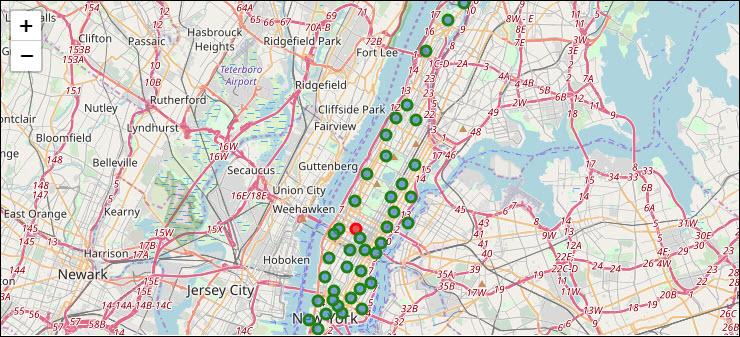
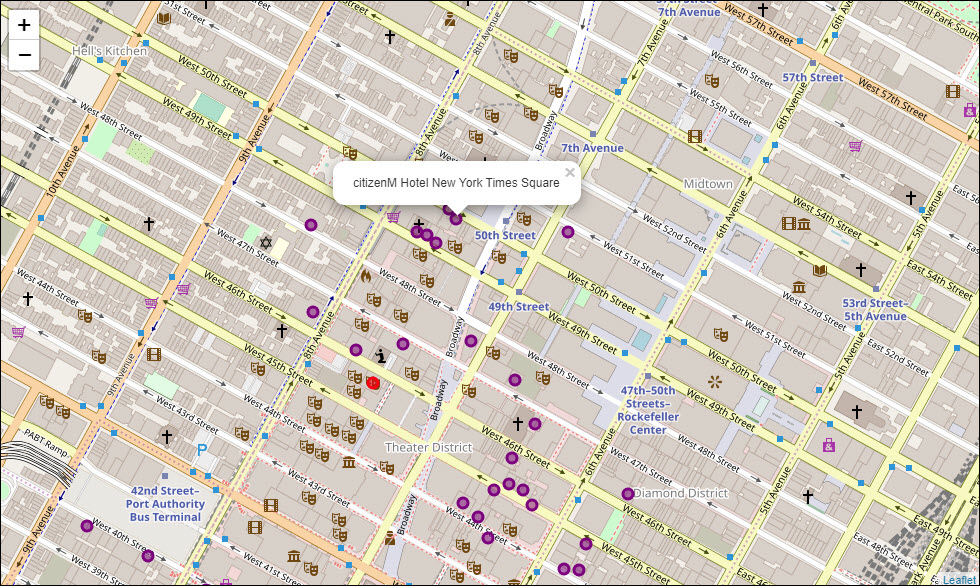

#  IBM Data Science Capstone Project Report
## Planning Travel and Tours in New York City's Broadway Theatre District
### Comparison of Hotels, Restaurants, and Theaters in Manhattan, NY for a Broadway Theater Trip
### Brian Vineyard 

## INTRODUCTION

This is my final Capstone Project for the IBM Data Science Professional Certification through Coursera.

Students were tasked with using data science tools and methods to do a detailed study of a city using the Foursquare API.

This project involved the use of Python 3 and Jupyter Notebooks. Tools used include pandas, numpy, JSON, pickle, GeoPy, BeautifulSoup, matplotlib, and sklearn.

### Business Problem


**Business Problem**: A travel service is planning to offer Broadway trips with the best options in New York City, NY to include on their package. They want to build a package with a list of Broadway shows, a recommended hotel, and a list of nearby restaurants. 

Their clients are mostly interested in Broadway musicals and plays, so this project will focus on finding the best hotel and restaurants near the Broadway theater district.


**Key Questions to Answer**

- What are the best theaters to catch the top Broadway shows?
- What hotels close to the Theater District have the best ratings and room rates?
- What are the best nearby restaurants?


**Foursquare API study of following city**:

- Broadway Theatre District, New York City, NY

Example search criteria: Hotels, Restaurants, Museums, Live Shows

**Project Details**: 

This project uses the following tools and technology:

- [Foursquare Places API](https://https://enterprise.foursquare.com/products/places)
- [2014 New York City Neighborhood Names](https://geo.nyu.edu/catalog/nyu_2451_34572)
- [BeautifulSoup](https://beautiful-soup-4.readthedocs.io/en/latest/)


The goal is to find the best area of the city to hold tours, based on our findings.

## DATA SOURCES

This project will use the following data:

- **Latitude and longitude of neighborhoods from the five boroughs of New York, NY**
  Source: 2014 New York City Neighborhood Names: https://geo.nyu.edu/catalog/nyu-2451-34572
- **Broadway Theatre Wiki with Current Shows in Production**
  Source: https://en.wikipedia.org/wiki/Broadway_theatre
- **Hotels and Restaurants near the Richard Rodgers Theatre - (where *Hamilton* is playing)
  Source: API Queries of Foursquare 
 - **Reviews of Hotels and Restaurants in the Foursquare Dataset
  Source: Google Reviews, Hotels.com data

## METHODOLOGY

The coordinates will be passed to the Foursquare Places API, for querying New York City neighborhoods for venues such as:

- **Restaurants**
    - Liebman's Deli, La Morada, Royal 35 Steakhouse, Le Benardin
- **Hotels**
    - Gramercy Park, Life Hotel Nomad, Mansfield Hotel
- **Fun**
    - Museums: Metropoliton Museum of Art, 9/11 Memorial, American Museum of Natural History
    - Top Tourist Destinations: Empire State Building, Madison Square Garden, Statue of Liberty, Times Square
    - Broadway Productions: Hamilton, The Lion King, Wicked, Moulin Rouge, Phantom of the Opera
    - Sightseeing Cruises: Circle Line Full Island, Classic Harbor Lines, Zephyr Yacht, Liberty Cruises
    - Parks: Central Park, Washington Square Park, Fort Tryon Park, Bronx Zoo, 
    
 ### Table of Contents
 1. [Import Libraries, Foursquare Credentials](#import-1)
 2. [New York's Manhattan Borough Neighborhood Data](#borough-2)
   - [Map of Neighborhoods in New York City's Five Boroughs](#borough-map)
   - [Map of Neighborhoods in NYC's Manhattan Borough](#neighor-map)
 3. [Broadway Theatres and Current Productions](#broadway-3)
   - [Map of Broadway Theatre Locations](#broadway-map)
 4. [Hotels Near the Broadway Theatre District](#hotels-4)
   - [Map of Hotels Near Broadway Theatres](#hotels-map)
 5. [Restaurants Near the Broadway Theatre District](#restaurants-5)
   - [Map of Restaurants Near Broadway Theatres](#rest_map)
 6. [Conclusions and Findings](#conclusions)
 
 ---
 
## 1. Import Libraries, Foursquare Credentials, and Neighborhood Data <a name="import-1"></a>

The first step in the project was to import libraries:

```python
import numpy as np # library to handle data in a vectorized manner
import pandas as pd # library for data analsysis
pd.set_option('display.max_columns', None)
pd.set_option('display.max_rows', None)
import json # library to handle JSON files
import pickle
from geopy.geocoders import Nominatim # Convert addresses into GPS coordinates
from bs4 import BeautifulSoup
import requests # library to handle requests
from pandas.io.json import json_normalize # transform JSON file into a Pandas dataframe
# Matplotlib and associated plotting modules
import matplotlib.cm as cm
import matplotlib.colors as colors
# import k-means from clustering stage
from sklearn.cluster import KMeans
import folium # map rendering library
print('Libraries imported.')
```
Foursquare credentials were imported using a pickle file.

```Python
# Loads the Foursquare credentials for logging in to the API

file = open('credentials2.p', 'rb')
credentials = pickle.load(file)
file.close()
CLIENT_ID = credentials['CLIENT_ID']
CLIENT_SECRET = credentials['CLIENT_SECRET']
VERSION = '20180604'
LIMIT = 30
```
---
## 2. New York's Manhattan Borough Neighborhood Data <a name="borough-2"></a>

Data for New York City's five boroughs and 306 neighborhoods were imported as a JSON file from 2014 data on NYU's website: https://geo.nyu.edu/catalog/nyu-2451-34572

This data included latitude and longitude coordinates for each of the 306 neighborhoods in the dataset.

###  Map of Neighborhoods in the New York City' Five Boroughs <a name="borough-map"></a>

A map was built in Folium using the NYU coordinate data:

```Python
# create map of New York using latitude and longitude values
map_newyork = folium.Map(location=[latitude, longitude], zoom_start=10)

# add markers to map
for lat, lng, borough, neighborhood in zip(neighborhoods['Latitude'], neighborhoods['Longitude'], neighborhoods['Borough'], neighborhoods['Neighborhood']):
    label = '{}, {}'.format(neighborhood, borough)
    label = folium.Popup(label, parse_html=True)
    folium.CircleMarker(
        [lat, lng],
        radius=5,
        popup=label,
        color='blue',
        fill=True,
        fill_color='#3186cc',
        fill_opacity=0.7,
        parse_html=False).add_to(map_newyork)  
    
map_newyork
```

### Map of Neighborhoods in NYC's Manhattan Borough <a name="neighbor-map"></a>


**Folium Map of New York City's 306 neighborhoods**

New York City has five boroughs:
    
    - Manhattan
    - The Bronx
    - Brooklyn
    - Queens
    - Staten Island
    
This project is focused on neighborhoods in Manhattan, as this is where Broadway's Theatre District is located.

Manhattan data was filtered and built into a new dataframe for that borough.

```Python
manhattan_data_df = neighborhoods[neighborhoods['Borough'] == 'Manhattan'].reset_index(drop=True)
```
Here is the generated dataframe showing 40 Manhattan neighborhoods:


### Build map of Manhattan neighborhoods from latitude and longitude coordinates ###

Close to Times Square, there is a TKTS ticket booth that sells ticket to all the Broadway shows.

Let's set our address in Nominatim for the TKTS ticket booth location get the coordinates.

Let's draw a map using Folium, marking the TKTS booth near Times Square as a central location in the Theatre District, with green markers for the neighborhoods in Manhattan.

```Python
address = 'Broadway at, W 47th St, New York, NY 10036'

geolocator = Nominatim(user_agent="ny_explorer")
location = geolocator.geocode(address)
latitude = 40.7591855
longitude = -73.9848361
print('The geograpical coordinates of the TKTS booth near Times Square are {}, {}.'.format(latitude, longitude))
```
The geograpical coordinates of the TKTS booth near Times Square are 40.7591855, -73.9848361.

```Python
# create map of the Theatre District in Manhattan using latitude and longitude values
map_manhattan = folium.Map(location=[latitude, longitude], zoom_start=11)

# add a red circle marker to represent the TKTS ticket booth
folium.features.CircleMarker(
    [latitude, longitude],
    radius=5,
    color='red',
    popup='TKTS ticket booth in Times Square',
    fill = True,
    fill_color = 'red',
    fill_opacity = 0.6
).add_to(map_manhattan)

# add markers to map
for lat, lng, label in zip(manhattan_data['Latitude'], manhattan_data['Longitude'], manhattan_data['Neighborhood']):
    label = folium.Popup(label, parse_html=True)
    folium.CircleMarker(
        [lat, lng],
        radius=5,
        popup=label,
        color='green',
        fill=True,
        fill_color='#3186cc',
        fill_opacity=0.7,
        parse_html=False).add_to(map_manhattan)  
    
map_manhattan
```


**Manhattan's 40 neighborhoods, with Broadway's TKTS booth near Times Square marked in red.**

---
## 3. Broadway Theatres and Current Productions <a name="broadway-3"></a>
## Theatres on Broadway - Maps and Analysis ##

Data on the 40 theatres currently showing Broadway productions was pulled in from a Broadway Theatre wiki page.

**Some of the most popular shows at the time of this project are**:


Let's start by using BeautifulSoup to parse a list of the theatres and currently running shows from the following Wikipedia page:
https://en.wikipedia.org/wiki/Broadway_theatre

BeautifulSoup Code to Scrape Theatre Data

```Python
# Use Beautiful Soup to get the theatre data from the wiki page
sourcelink = 'https://en.wikipedia.org/wiki/Broadway_theatre'
source = requests.get(sourcelink).text
soup = BeautifulSoup(source, 'html.parser')
print(soup.prettify())
```
This returns the HTML code for the Wiki page. 

```Python
# Build dataframe with theatre data

Theatre_Data_df = pd.DataFrame({'Theatre':'',
                          'Address':'',
                          'City':'',
                          'State':'', 
                          'Capacity':int(),
                          'OwnerOperator':'',
                          'CurrentProduction':'',
                          'Type':'',
                          'Opening':'',
                          'Closing':'',
}, 
             index=[1])
```
```Python
# Build theatres table from matching table on the theatres wiki page and view the HTML code
theatres_table = soup.find('table', {'class':'wikitable sortable'})
theatres_table
```
```Python
 
for tr in theatres_table.find_all('tr'):
    i = 0
    for td in tr.find_all('td'):
        if i == 0:
            Theatre = td.text
            i = i + 1
        elif i == 1:
            Address = td.text
            i = i + 1
        elif i == 2:
            Capacity = td.text
            i = i + 1
        elif i == 3:
            Owner_Operator = td.text
            i = i + 1
        elif i == 4:
            CurrentProduction = td.text
            i = i + 1
        elif i == 5:
            Type = td.text
            i = i + 1
        elif i == 6:
            Opening = td.text
            i = i + 1
        elif i == 7:
            Closing = td.text.strip('\n').replace(']','')
            i = i + 1        
            Theatre_Data_df = Theatre_Data_df.append({'Theatre': Theatre,'Address': Address,'Capacity': Capacity, 'OwnerOperator': Owner_Operator, 'CurrentProduction': CurrentProduction, 'Type': Type, 'Opening': Opening, 'Closing': Closing},ignore_index=True)
```
This returns data for 40 theatres with the current productions on Broadway.

The data was then cleaned by removing some columns, such as City, State, OwnerOperator, Opening, and Closing.
```Python
# Let's drop some of the columns that aren't needed
Theatre_Data_df.drop(['OwnerOperator','Opening','Closing'],axis=1)
```
The results at this stage looked like this:


Next the data was downloaded to Excel, with more data cleaning for the address and show title fields. Also City, State, and Latitude and Longitude coordinates for the theatres was added.

Here is a view of the final table:


### Map of Broadway Theatre Locations <a name="broadway-map"></a>

The next step was to map out the theatre locations using Folium.

```Python
# Setting the latitude and longitude of Broadway
broadway_latitude = 40.75659 # neighborhood latitude value
broadway_longitude = -73.98626, # neighborhood longitude value
neighborhood_name = 'Broadway'
print('Latitude and longitude values of {} are {}, {}.'.format(neighborhood_name, 
                                                               broadway_latitude, 
                                                               broadway_longitude))
```
```Python
# create map of the Broadway theatre district using latitude and longitude values
map_broadway = folium.Map(location=[broadway_latitude, broadway_longitude], zoom_start=14)

# add markers to map
for lat, lng, label in zip(Theatre_Data_df4['Latitude'], Theatre_Data_df4['Longitude'], Theatre_Data_df4['Theatre']):
    label = folium.Popup(label, parse_html=True)
    folium.CircleMarker(
        [lat, lng],
        radius=5,
        popup=label,
        color='black',
        fill=True,
        fill_color='purple',
        fill_opacity=0.7,
        parse_html=False).add_to(map_broadway) 

map_broadway
```
Here is a detailed view of the generated map, with theatre locations marked in purple:


**Map Showing Locations of 40 Broadway Theatres in Manhattan, New York City**

#### Theatre Location Analysis ####

Looking at the mapped results, we see that the greatest concentration of theatres appears clustered near 44th and 45th streets between 7th Avenue and 8th Avenue.

This area is looking like a great spot to find local restaurants and hotels.

Let's set our starting point at the Richard Rodgers Theatre where *Hamilton* is currently playing.

This theatre is also located near the center of our cluster:


**Google Maps street level view of the intersection of West 47th Street and 7th Avenue from the TKTS booth location**:


---
## 4. Hotels Near the Broadway Theatre District <a name="hotels-4"></a>
### Search with the Foursquare API for Hotels near the Richard Rodgers Theatre

We will use the address of Richard Rodgers Theatre as our starting point as we look for nearby hotels using the Foursquare API.

Let's get the hotel's latitude and longitude values.
### Map of Hotels Near Broadway Theatres <a name="hotels-map"></a>
```Python
# Set address of Richard Rodgers Theatre as our starting point
address = '226 West 46th Street, New York, NY'
geolocator = Nominatim(user_agent="foursquare_agent")
location = geolocator.geocode(address)
latitude = location.latitude
longitude = location.longitude
print(latitude, longitude)
```
40.7590309 -73.98674788284762

Next we queried Foursquare to view hotels within a given 500 meter radius of the Richard Rodgers Theatre.

```Python
search_query = 'Hotel'
radius = 500
print(search_query + ' .... OK!')
```
We build the URL to pass to the Foursquare API to get the hotels 
```Python
url = 'https://api.foursquare.com/v2/venues/search?client_id={}&client_secret={}&ll={},{}&v={}&query={}&radius={}&limit={}'.format(CLIENT_ID, CLIENT_SECRET, latitude, longitude, VERSION, search_query, radius, LIMIT)
url
```
This query returns JSON data:
```Python
results = requests.get(url).json()
results
```

```Python
# assign relevant part of JSON to venues
venues = results['response']['venues']

# tranform venues into a dataframe
dataframe = json_normalize(venues)
dataframe.head()
```


#### Let's look at data for Hotels within 500 meters of the Richard Rodgers Theatre
```Python
# keep only columns that include venue name, and anything that is associated with location
filtered_columns2 = ['name', 'categories'] + [col for col in dataframe.columns if col.startswith('location.')] + ['id']
dataframe_filtered2 = dataframe.loc[:, filtered_columns2]

# function that extracts the category of the venue
def get_category_type(row):
    try:
        categories_list = row['categories']
    except:
        categories_list = row['venue.categories']
        
    if len(categories_list) == 0:
        return None
    else:
        return categories_list[0]['name']

# filter the category for each row
dataframe_filtered2['categories'] = dataframe_filtered2.apply(get_category_type, axis=1)

# clean column names by keeping only last term
dataframe_filtered2.columns = [column.split('.')[-1] for column in dataframe_filtered2.columns]

dataframe_filtered2
```


Viewing the data just on the name column:


Let's map out the hotels returned in our Foursquare search.

### Map of Hotels Near Broadway Theatres <a name="hotels-map"></a>

First let's show a map of the hotel locations, so we can get a view of where they are in relation to the theatre.
```Python
# create map of Manhattan using latitude and longitude values
map_hotels = folium.Map(location=[latitude, longitude], zoom_start=15)

# add a red circle marker to represent the Midtown Manhattan neighborhood center
folium.features.CircleMarker(
    [latitude, longitude],
    radius=5,
    color='red',
    popup='Richard Rodgers Theatre - Home of Hamilton',
    fill = True,
    fill_color = 'red',
    fill_opacity = 0.6
).add_to(map_hotels)

# add markers to map
for lat, lng, label in zip(dataframe_filtered2['lat'], dataframe_filtered2['lng'], dataframe_filtered2['name']):
    label = folium.Popup(label, parse_html=True)
    folium.CircleMarker(
        [lat, lng],
        radius=5,
        popup=label,
        color='purple',
        fill=True,
        fill_color='purple',
        fill_opacity=0.5,
        parse_html=False).add_to(map_hotels)  
    
map_hotels
```


**Hotels near Richard Rodgers Theatre (Hamilton) with 4-Star citizenM Hotel location shown**

---

The hotel data was filtered by distance, and hotels were iteratively reviewed starting with the closest hotel, the Hotel Edison, then moving successively through the hotels in order of distance in meters from the Richard Rodgers Theatre.

The user ratings and reviews from Foursquare and Google Reviews pointed to the citizenM Hotel as the best choice for our package. The location of the citizenM is noted in the map image above.

Here is the Foursquare API processing for the citizenM Hotel:

```Python
venue_id = '5093c236830214706abb75db' # citizenM Hotel ID
url = 'https://api.foursquare.com/v2/venues/{}?client_id={}&client_secret={}&v={}'.format(venue_id, CLIENT_ID, CLIENT_SECRET, VERSION) 
```
```Python
result = requests.get(url).json()
print(result['response']['venue'].keys())
result['response']['venue']
```

```

```Python
try:
    print(result['response']['venue']['rating'])
except:
    print('This venue has not been rated yet.')
```
9.2

Further analysis revealed this 9.2 score for the citizenM Hotel was based on 412 ratings, so this hotel looks like an excellent choice for our travel package. 

There were also 83 tips for the hotel in Foursquare, but due to limitations on the free Foursquare Developer account used for testing, the details for only a single tip can be returned and viewed.


---
## 5. Restaurants Near the Broadway Theatre District and citizenM Hotel <a name="restaurants-5"></a>

Now that we have a great hotel for our package, the final step is to find nearby restaurants using the Foursquare API.

We can provide a list as suggestions for travelers.

No single venue was selected as the best, however, as we want to give our customers a wide range of choices based on their tastes.

First, we set our search coordinates for the hotel's location.
```Python
# Latitude and Longitude of citizenM Hotel
latitude = 40.761691
longitude = -73.984953
```
Restaurants within a 500 meter radius were generated using Foursquare's API.

This generated the following list of nearby restaurants:


### Map of Restaurants Near the Broadway Theatre District <a name="rest-map"></a>

Let's map out the location of the 30 restaurants near the citizenM Hotel returned by our Foursquare query.
```Python
restaurants_map = folium.Map(location=[latitude, longitude], zoom_start=15) # generate map centred around the citizenM Hotel

# add a red circle marker to represent the citizenM Hotel
folium.features.CircleMarker(
    [latitude, longitude],
    radius=5,
    color='red',
    popup='citizenM Hotel',
    fill = True,
    fill_color = 'red',
    fill_opacity = 0.6
).add_to(restaurants_map)

# add the restaurants as blue circle markers
for lat, lng, name in zip(restaurants_filtered_df['lat'],restaurants_filtered_df['lng'],restaurants_filtered_df['name']):
    label = '{}'.format(name)
    label = folium.Popup(label, parse_html=True)
    folium.CircleMarker(
        [lat, lng],
        radius=5,
    popup=label,
    color='yellow',
    fill=True,
    fill_color='red',
    fill_opacity=0.7,
    parse_html=False).add_to(restaurants_map)

# display map
restaurants_map
```


**Restaurants near the citizenM Hotel, marked in red, returned by Foursquare API**

Now that we have some nearby restaurants we can build out the details of our tour package.
---
## 6. Conclusions and Findings <a name="conclusions"></a>

We have researched the Broadway Theatre District in the Manhattan borough of New York City, and now have list of current shows and theatres where they are appearing.

We also have a list of hotels near the Richard Rodgers Theatre where Hamilton is continuing it's long rung. From this list, we have a recommended hotel, the citizenM with a 9.2 rating from over 400 users.

Finally, we have a list of restaurants close to our hotel we can build in our travel package.

Here is a report on the findings.

- [Current Broadway Productions and Associated Theatres](#current-productions)
- [Recommended Hotel](#recommend-hotel)
- [Nearby Restaurants](#nearby-rest)
### Current Broadway Productions and Associated Theatres <a name="current-productions"></a>


### Recommended Hotel <a name="recommend-hotel"></a>

The recommended hotel for our package is the 4-Star citizenM Hotel.


- **Address**: 218 W 50th St, New York, NY 10019
- **Reviews**: 4.6 stars, with 1,587 reviews on Google.
- **Room Rates**: as low as $169 a night
- **Features**: In walking distance of many of the Broadway Theatres, this hotel has the following amenities:

**From the citizenM website**:

Located just off the corner of Broadway and 50th street, our New York hotel is right in the heart of Midtown Manhattan, smack bang in the middle of the Theater District. A 5 minute walk from 5th Avenue, Madison Avenue, Central Park and Columbus Circle, 10-15 minutes away from the major museums, Rockefeller Center and the Empire State Building, and an easy subway or cab ride to anywhere else in the city, from Soho to the Meatpacking District – so if you’re looking for the coolest hotels New York has to offer, check out citizenM.

### Nearby Restaurants <a name="nearby-rest"></a>
The following 30 restaurants are within walking distance of the citizenM Hotel:


